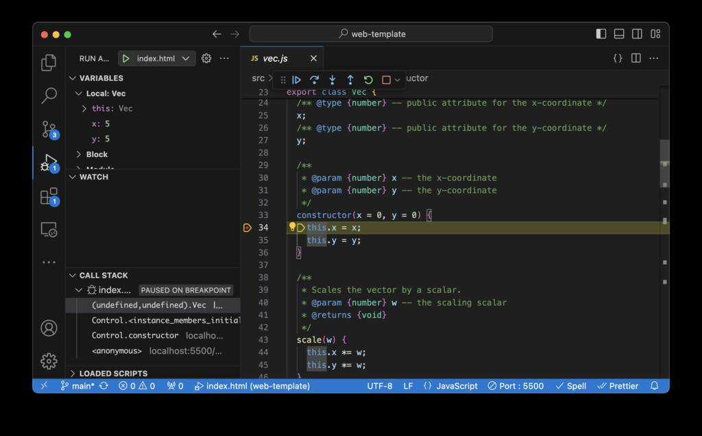
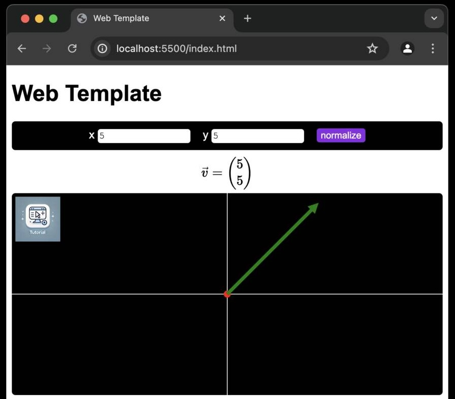

# Web Template

<!-- TODO: more screenshots; express.js: secure login, DB -->

> Template for a Vanilla JavaScript-based Web Application using VSCode: Setup, structuring, debugging, and minification.

There are countless HTML/JavaScript tutorials available. This one is designed as a starting point for students with little experience in web development, as well as for experienced users who want to switch to _Visual Studio Code_ and utilize its linter and debugger features.

We will **not** cover JavaScript libraries for rapidly building user interfaces, such as `react`, `vue.js`, or `angular`, as we believe it is necessary to first understand the foundations. These libraries should be used **after** studying this tutorial.

We will not provide a detailed introduction to JavaScript syntax but will demonstrate object-oriented JavaScript code that is easy to understand, and a well-structured project setup.

Finally, we will demonstrate how to include external libraries and use a build tool to bundle and minify the code.

_Note: Some of the text in this README was generated by a language model. However, everything has been reviewed and revised by a human (me)._

## Installation

Download and install [Visual Studio Code (VS Code)](https://code.visualstudio.com/download).

Clone this repository via `git clone https://github.com/andreas-schwenk/web-template.git`, or use [GitHub Desktop](https://desktop.github.com), or download and extract the code as `ZIP` file.

Open VS Code and open the example project via `File` &rarr; `Open` from the main menu.

We will need to run a local web server. There are several options for doing this, but the easiest way is to install and use a VS Code extension.

- This repository uses the "Live Server" extension by Ritwick Dey. After opening the repository in VS Code, you will be prompted to install the recommended extensions. If the prompt does not appear, click on "Extensions" in the left panel and install it manually.

- Alternatively, you can run a web server via `python3 -m http.server 5500` (requires Python to be installed).

## Dependencies

`npm` stands for Node Package Manager. It is the default package manager for the JavaScript runtime environment Node.js, allowing developers to share, distribute, and manage dependencies in their projects.

To install all the dependencies listed in the `package.json` file, open the terminal (`Terminal` &rarr; `New Terminal` in the main menu) and type `npm i`, then press enter.

We will use two dependencies in this project. The first is `esbuild`, an extremely fast JavaScript bundler and minifier. It compiles the source files from the `src/` directory into a single, small JavaScript file in the `dist/` directory. However, since our project is set up as a `module`, a bundler is not strictly necessary. For more details, refer to the "Compilation, Bundling, Minification" section below.

The second dependency is `katex`, which is used to render mathematical equations with [TeX](https://en.wikipedia.org/wiki/TeX). This dependency is not included in the provided source code, so you will need to follow the steps outlined in this tutorial to include the library.

## First Run

If you open `index.html` in your favorite browser, you will notice that the site does not function correctly: the button does nothing, and the drawing area is black. Open the browser's console to check for any errors. Depending on your browser, you might see messages such as "Failed to load resource: Origin null is not allowed by Access-Control-Allow-Origin." This occurs because the browser does not have permission to access other local files.

Start a local web server on port `5500`. If you prefer to use a different port number, be sure to update it in the `.vscode/launch.json` file.

If you have installed the `Live Server` extension in VS Code, click on `Go Live` in the bottom-right corner of the VS Code window. This will open the `Chrome` browser, and the page should work successfully.

Alternatively, start a web server by running `python3 -m http.server 5500` and then enter `localhost:5500` in your browser's URL bar.


## Files

The following tables list all the directories and files in this repository. Reviewing each file will help you gain a deeper understanding.

| path            | description                                                             |
| --------------- | ----------------------------------------------------------------------- |
| `.vscode/`      | Configuration files for the VS Code project                             |
| `dist/`         | Bundled/minified JavaScript output                                      |
| `img/`          | Images                                                                  |
| `node_modules/` | Dependencies that are installed via `npm install`                       |
| `src/`          | The core implementation in form of JavaScript files                     |
| `test/`         | Code tests                                                              |
| `.gitignore`    | Paths that are ignored by `git`                                         |
| `build.js`      | Compilation script that outputs files in `dist/`                        |
| `index.html`    | Root HTML file of the web app                                           |
| `jsconfig.json` | JavaScript configuration for VS Code                                    |
| `LICENSE`       | License of this repository                                              |
| `package.json`  | Manages project dependencies, scripts, and metadata in Node.js projects |
| `README.md`     | This Readme file                                                        |

Directory `.vscode/` provides configuration files for this project:

| path                      | description                      |
| ------------------------- | -------------------------------- |
| `.vscode/extensions.json` | Recommended VS Code extensions   |
| `.vscode/launch.json`     | VS Code debugging Configurations |
| `.vscode/settings.json`   | VS Code project settings         |

Directory `src/` contains all JavaScript implementation files:

| path             | description                            |
| ---------------- | -------------------------------------- |
| `src/index.js`   | Root JavaScript file                   |
| `src/vec.js`     | Implements a class for a 2D-Vector     |
| `src/control.js` | Implements the behavior of the web app |
| `src/draw.js`    | Implements the drawing of the vector   |

## JSDoc

JavaScript is a dynamically typed language, meaning variable types are determined at runtime rather than at compile time, allowing variables to hold values of any type without explicit declarations. This flexibility can simplify code but may introduce runtime type errors.

JSDoc is used in JavaScript to provide inline documentation and type annotations, helping developers understand and maintain code. It generates documentation and enhances code editor support, such as autocompletion and type checking.

In VS Code, file `jsconfig.json` is used to configure the JavaScript language service, enabling features like IntelliSense, code navigation, and project-wide type checking.

To gain a better understanding, open the files `src/vec.js` and `src/control.js` and study the JSDoc comments, which begin with `/**`.

> You should always provide JSDoc comments for each class, method, attribute, global variable, method/function parameter, return type, and so on.

## Debugging

We can either debug the entire website or debug individual JavaScript files using Node.js.

### Debugging with a browser

1. Start the web server as described in the "First Run" section above.
2. Select `index.html` in the top-left panel of VS Code.
3. Enable debugging breakpoints: open a JavaScript file and click to the left of the line number (refer to the screenshot below).
4. Press [F5] or go to [Run] &rarr; [Start Debugging] in the main menu.

The debugger will stop at the first breakpoint. Use the navigation bar to step through, continue, restart, or stop the execution. Observe the variable values in the left panel.



### Debugging with Node.js

Some code does not require a browser to run. For example, the `Vector` class in `src/vec.js` can be executed headlessly using [Node.js](https://nodejs.org/en/download/package-manager). In this case, a web server is not needed.

1. Select `node: current file` from the drop-down menu in the top-left corner of VS Code.
2. Enable debugging breakpoints by opening a JavaScript file and clicking to the left of the line number.
3. Press [F5] or go to [Run] → [Start Debugging] in the main menu.

### Launch.json

In the previous sections, we used the launch configurations `index.html` and `node: current file`. These configurations are defined in the `.vscode/launch.json` file. For more details, refer to the [official documentation](https://code.visualstudio.com/docs/editor/debugging).

## Code Styling

Code styling involves conventions for formatting and structuring code to ensure readability, consistency, and maintainability. This includes rules for indentation, naming conventions, spacing, and comments.

Consistent code style aids collaboration and simplifies maintenance. Tools like ESLint and Prettier enforce these conventions in JavaScript. Here, we will use the built-in tools in VS Code.

### Template for a JavaScript file

The following template illustrates a recommended layout for a JavaScript file.

```js
/**
 * Project name
 * Author(s) / Institute / Contact
 * License
 * Changelog (optional)
 */

/*
 * Short description of the current file.
 */

// <list of imports to external dependencies>

// <list of imports to local dependencies>

// <list of global variables>

// <list of exported classes / functions>

// <list of local classes / functions (helpers)>
```

Some Notes:

- Global variables should be used sparingly.

- Classes and functions used in other source files must be exported using the `export` keyword. Only export classes and functions when necessary; for example, keep helper functions visible only within the current file.

## Object Oriented Programming

JavaScript is a prototype-based language, meaning it uses prototypes to achieve inheritance and reuse code. Instead of defining classes, JavaScript objects inherit directly from other objects. Each object has a prototype, which is another object from which it can inherit properties and methods. This allows for dynamic and flexible object creation and inheritance.

Since ECMAScript 6 (ES6), JavaScript has direct support for object-oriented programming (OOP).

Study classes in files `src/vec.js`, `src/draw.js`.

**Note:** In JavaScript, private attributes can be defined using the `#` prefix, introduced in ECMAScript 2022. These attributes are only accessible within the class where they are defined, ensuring encapsulation and data privacy. Later, we will use a build tool to support older browsers. Since private attributes are very useful but still rarely used in existing projects, we provide the following example:

```javascript
/**
 * Demo class showcasing public and private attributes
 */
class MyClass {
  /* @type {number} -- private attribute for a number */
  #privateAttribute;
  /* @type {number} -- public attribute for a number */
  publicAttribute = 5;

  /**
   * @param {number} value -- the number
   */
  constructor(value) {
    // initialize privateAttribute with a given value
    this.#privateAttribute = value;
  }

  /**
   * Getter function for the private attribute
   * @returns {number}
   */
  getPrivateAttribute() {
    return this.#privateAttribute;
  }
}

// create an instance
let inst = new MyClass(42);
console.log(inst.publicAttribute); // prints 5
console.log(inst.getPrivateAttribute()); // prints 42
```

## Compilation, Bundling, Minification

In the context of web development, JavaScript is compiled to ensure compatibility across different browsers and environments. Modern JavaScript features and syntax introduced in ES6 and beyond are not fully supported by all browsers, especially older versions.

1. **Compatibility**: Code can be transformed into a version that works across all browsers, ensuring a consistent user experience.
2. **Optimization**: Compiling can optimize the code for performance, reducing load times and improving execution speed.
3. **Advanced Features**: Developers can use modern language features, such as modules, classes, async/await, and more, without worrying about browser support.
4. **Tooling Integration**: Compilers like Babel can integrate with other tools and frameworks, providing additional features like JSX for React, TypeScript support, and minification.

Overall, compiling JavaScript helps leverage the latest advancements in the language while maintaining broad compatibility and performance.

### Esbuild

In this repository, `esbuild` is used to handle modern JavaScript code efficiently. It offers rapid build times and optimized output.

If needed, first install Node.js. Then run the following command to compile the source files in the `src/` directory. The output will be written to `dist/myApp.min.js`.

```bash
npm run build
```

Currently, our implementation in `index.html` imports all JavaScript files as `module`. To use the minified version, comment out `<script type="module"...` and uncomment the lines to include the minified version.

Some notes:

- The command `npm run build` is configured in the `package.json` file. The `scripts` section lists a set of custom scripts, and in this case, the alias `build` translates to `node build.js`. Therefore, you could also simply type `node build.js` in the terminal to achieve the same result.

- Refer to the `build.js` file to see the details of how `esbuild` is used.

## Testing

In web development, testing is a crucial process to ensure the functionality, performance, and reliability of web applications. It typically involves several types of testing:

1. **Unit Testing**: Testing individual components or functions in isolation to ensure they work as expected. Tools like Jest and Mocha are commonly used.

2. **Integration Testing**: Testing how different components of the application work together. This ensures that the interactions between different modules are functioning correctly.

3. **End-to-End (E2E) Testing**: Testing the entire application flow, from start to finish, to ensure the system works as a whole. Tools like Cypress and Selenium are often used.

4. **Performance Testing**: Assessing the speed, responsiveness, and stability of the application under various conditions. Tools like Lighthouse and WebPageTest are used for performance testing.

5. **Accessibility Testing**: Ensuring the web application is usable by people with disabilities. Tools like axe and Lighthouse can help identify accessibility issues.

6. **Cross-Browser Testing**: Ensuring the application works correctly across different web browsers and versions. Tools like BrowserStack and Sauce Labs facilitate cross-browser testing.

7. **Security Testing**: Identifying and fixing vulnerabilities to protect the application from threats. Tools like OWASP ZAP and Burp Suite are used for security testing.

Testing helps identify and fix bugs early, improve code quality, and ensure a smooth user experience.

This repository includes unit tests only for the `src/vec.js` file. To run the tests, use the following command:

```bash
npm run test
```

All tests are implemented in the `tests/` directory.

## External modules

This template does not use any external dependencies except for `esbuild`. In larger projects, existing libraries should be used to avoid reinventing the wheel.

As an example, we include `katex` in the following section to display the vector as a mathematical equation. Refer to the screenshot below to see the results.

- First, go to [npmjs.com](https://www.npmjs.com) and search for `katex`. You will see a list of related packages. Click on `katex` to open its page at [https://www.npmjs.com/package/katex](https://www.npmjs.com/package/katex).

- Review the package description and optionally visit the demo site. Then, use the following command to install the package:

  ```bash
  npm install katex
  ```

  Run the command in the terminal. You will notice a new dependency entry in the `package.json` file, and the `node_modules/` directory will now include a new path for `katex`, along with additional directories for its dependencies.

We will now modify the `src/index.html` file for our implementation:

- Insert the following code just before `<canvas id...`. This will create the target div element where the equation will be rendered.

  ```js
  <div class="math" id="math"></div>
  ```

- Optionally, add a style class within the `<style>...</style>` tags.

  ```css
  .math {
    text-align: center;
    margin-bottom: 5px;
  }
  ```

- Since `katex` uses CSS to style the rendered equations, insert the following line before `<title>...`.

  ```js
  <link rel="stylesheet" href="node_modules/katex/dist/katex.min.css" />
  ```

- We need to provide an import map to make `katex` accessible in the implementation in `src/`. Insert the following code before `<script type="module">...`.

  ```js
  <script type="importmap">
    {
      "imports": {
        "katex": "./node_modules/katex/dist/katex.mjs"
      }
    }
  </script>
  ```

Now we are ready to use `katex`. We will modify the file `src/control.js`:

- Add an import statement before the local import statements.

  ```js
  import katex from "katex";
  ```

- Add the following code at the end of the `view()` method:

  ```js
  // == update the rendered math equation ==
  // get the div element
  const div = document.getElementById("math");
  // get the coordinates of the vector
  const x = this.vec.x;
  const y = this.vec.y;
  // construct the TeX-equation
  const tex = `\\vec{v} = \\begin{pmatrix}${x}\\\\${y}\\end{pmatrix}`;
  // generate HTML code and set it to the equation target div element
  div.innerHTML = katex.renderToString(tex);
  ```

Debug the website by pressing [F5], ensuring that `index.html` is selected in the dropdown menu in the top-left area of VS Code first.



**Note:** Keep an eye on the size of the minified JavaScript file `dist/myApp.min.js`. With many packages available, it's important to choose those that best meet your needs to avoid unnecessary bloat. For example, including `katex` results in an output file size of over 250 KB. Additionally, consider the compressed size (approximately 80 KB in this case), as many web servers compress files before transmission.

## TypeScript

TypeScript offers static typing, enhanced IDE support, and improved code maintainability compared to JavaScript. It detects errors early and supports advanced features like interfaces and generics. However, it has a steeper learning curve, requires a compilation step, and involves more configuration. Despite these drawbacks, TypeScript is beneficial for large, complex projects due to its reliability and readability improvements.

We will not cover TypeScript in this context.

## Server Side Development

In this tutorial, we will use Express.js as the server. The example code will demonstrate how to store data in a local file.

Express.js is a minimal and flexible Node.js web application framework that provides a robust set of features to build web and mobile applications. It simplifies the development process by offering a range of HTTP utility methods and middleware, enabling the creation of APIs and dynamic web pages efficiently.

Visit [https://expressjs.com](https://expressjs.com) for detailed information.

Installation:

```bash
npm install express --save
```

### Server side code 1/2

Create a new file named `server.js` in the root directory of your repository, and then paste the following code into it:

```js
import express from "express";
import path from "path";
import fs from "fs";

const app = express();
app.use(express.json());
app.use(express.urlencoded({ extended: true }));

const port = 3000;

app.get("/", (req, res) => {
  res.send("Hello, World!");
});

app.listen(port, () => {
  console.log(`Example app listening on port ${port}`);
});
```

Start the server using Node.js with the following command:

```bash
node server.js
```

Open your web browser and navigate to `http://localhost:3000/`. Verify that the "Hello, World!" message appears on the page.

To debug the server, switch to the `Run and Debug` view by clicking the debug icon in the left panel, then select `node: current file` from the drop-down menu at the top.

**Hint:** A better solution is to add a new entry in `.vscode/launch.json`. Copy the `node: current file` entry, rename it to `server`, and change `${file}` to `server.js`.

Start debugging by pressing [F5] or navigating to `Run` &rarr; `Start Debugging` in the main menu.

To enable JavaScript language features for the server file in VS Code, update the include path in `jsconfig.json` as follows:

```
"include": ["src/**/*.js", "test/**/*.js", "server.js"],
```

### Server side code 2/2

So far, only a single string ("Hello, World!") is being sent to the browser.

First, we need to send the `index.html` file instead of the string. Here's how to do it:

```js
res.sendFile("index.html", { root: __dirname });
```

Since we enabled `module` mode in the `package.json` file, the identifier `__dirname` is not available. To fix this, add the following code before `const app = ...`:

```js
import { fileURLToPath } from "url";
const __filename = fileURLToPath(import.meta.url);
const __dirname = path.dirname(__filename);
```

Stop and restart the server. In the browser console, you'll notice that loading the module from `http://localhost:3000/src/index.js` is blocked. This happens because only the root (i.e., `index.html`) is being served. To resolve this, we need to add a route to serve static files. Insert the following lines after `const port = `:

Put the following lines after `const port = `:"

```js
// serve static files
app.use(express.static(path.join(__dirname, ".")));
```

The page should now be visible, similar to how it appeared when using the Live-Server (or Python-Server) at the start of the tutorial.

Now, we will add a route that saves files. Insert the following code before `app.listen(...)`.

```js
// route for saving data a local text file
app.post("/save", (req, res) => {
  console.log("... saving data ");
  let data = JSON.stringify(req.body);
  fs.writeFile("data.txt", data, (err) => {
    if (err) {
      console.error(err);
      return res.status(500).send("Error saving the content");
    }
    // respond to the server
    res.send("Content saved successfully");
  });
});
```

This code defines a POST route that receives a string from the client and saves it to a local file.

### Client side code

We now need to send the data from the client side to the server. For simplicity, we’ll save the current vector data when the user clicks the "normalize" button.

In the file `src/control.js`, add the following code to the event handler:

```js
let data = this.vec.toJSON();
fetch("/save", {
  method: "POST",
  headers: {
    "Content-Type": "application/json",
  },
  body: JSON.stringify(data),
})
  .then((response) => response.text())
  .then((response) => {
    console.log(response);
    alert(response);
  });
```

Restart the server and check if a file named `data.txt` is created in the root directory of the repository (for better organization in a real project, you should create a `data/` directory). The browser should display an alert message saying `Content saved successfully`.

### Databases

We use `MariaDB` as our database to store basic user data. The example code provides a login page that asks for a username and password. When the user clicks `login` and the provided credentials are correct, the main page opens.

First, create a login page named `login.html`:

```html
<!DOCTYPE html>
<html>
  <head>
    <meta charset="utf-8" />
    <title>Login</title>
  </head>
  <body>
    <form action="/auth" method="post">
      User:
      <input type="text" id="username" name="username" required />
      Password:
      <input type="password" id="password" name="password" required />
      <input type="submit" value="log in" />
    </form>
  </body>
</html>
```

"Optionally, use CSS to enhance the visual appearance.

Next, we need to set up the server code. First, install the database, and then add a route to `server.js`. Additionally, change the default file from `index.html` to `login.html`.

Please note that some commands will use the name `mysql` instead of `mariadb`. To install it on Linux, follow these steps:"

```bash
sudo apt install mariadb-server
```

Configure MariaDB as follows:

```bash
sudo mysql_secure_installation
```

Since the current root password is empty, press [ENTER] to skip. Then set a new root password. Remove the anonymous user and disallow remote login for the root user. Optionally, remove the test database. Finally, reload the privilege tables.

Access MariaDB as the root user by running the command `sudo mariadb -p`.

Create a new database named `example` and switch to it:

```sql
create database example;
use example;
```

Create a table named `users` with a primary key `id`, and two columns `username` and `password`, both of type `VARCHAR(256)`. Afterwards, verify the table structure using `DESCRIBE users;` to ensure it has the desired properties. Then, add a new user with the username `admin` and password `1337`.

```sql
create table Users (id int not null auto_increment, username varchar(256) not null, password varchar(256) not null,
primary key(id));
insert into Users (username, password) values ('admin', '1337');
select * from Users;
```

Please note that the password is currently stored in plaintext, which is _not_ secure.

At the moment, only the Linux root user can access `mariadb`. We need to create a new, less privileged user named `alpha`:

```sql
create user alpha@localhost identified by 'pwd42';
grant all on example.* to alpha@localhost;
flush privileges;
```

"Exit MariaDB using the shortcut [CTRL]+[D] or the command `exit`. Then, check access for the new user by running `mariadb -u alpha -p` in the command line.

To enable database access from the server-side Express application, install the `mysql` package as follows. Observe the new entry in `package.json`:"

```bash
npm install mysql --save
```

Establish the connection to the database in `server.js` by adding the following line to the import section:

```js
import mysql from "mysql";
```

Next, establish the connection as follows:

```js
const connection = mysql.createConnection({
  host: "127.0.0.1",
  user: "alpha",
  password: "pwd42",
  database: "example",
  multipleStatements: true,
});
connection.connect(function (err) {
  if (err) throw err;
});
```

Restart the server to verify that the connection to the database is established. If successful, no error messages will be printed.

Next, add a new route to handle user login:

```js
app.post("/auth", function (request, response) {
  const username = request.body.username;
  const password = request.body.password;
  console.log("user=" + username); // debug info
  console.log("password=" + password); // debug info
  const query =
    "SELECT password FROM users WHERE username = " + '"' + username + '"';
  connection.query(query, [], function (error, results, fields) {
    if (error) {
      throw error;
    } else if (results.length > 0) {
      const passwordInDB = results[0].password;
      if (passwordInDB === password) {
        response.redirect("/main");
      } else {
        response.send("wrong password!");
      }
    } else {
      response.send("login failed!");
    }
    response.end();
  });
});
```

Modify the main route to open `login.html` instead of `index.html`:

```js
app.get("/", (req, res) => {
  res.sendFile("login.html", { root: __dirname });
});
```

In the case of a successful login, the user will be redirected to `/main`. Here is the implementation of that route:

```js
app.get("/main", function (request, response) {
  response.sendFile("index.html", { root: __dirname });
});
```

### Secure Login

The previous section provided a basic explanation of how to use databases for login functionality, but it did _not_ address potential attacks and security measures.

Here are some suggestions for improvements:

#### **Broken Authentication**

Currently, it's possible to access the main page without logging in by directly entering the URL `http://localhost:3000/main`. This occurs because we haven't implemented a session validation check.

To address this, first install the `express-session` package:

```bash
npm install express-session
```

Next, import the newly installed `express-session` package in the `server.js` file:

```js
import session from "express-session";
```

First, we need to configure the session:

```js
app.use(
  session({
    secret: "secret",
    name: "myCookie",
    cookie: { httpOnly: false, sameSite: true },
    resave: true,
    saveUninitialized: true,
  })
);
```

In the `/auth` route, we need to store the user credentials right before redirecting to the main route:

```js
if (passwordInDB === password) {
  request.session.loggedin = true;
  request.session.username = username;
  response.redirect("/main");
}
```

**Note that the attributes `loggedin` and `username` are self-chosen names.**

The main route has to be modified to check if the user has logged in successfully:

```js
app.get("/main", function (request, response) {
  if (request.session.loggedin) {
    response.sendFile("main.html", { root: __dirname });
  } else {
    response.send("You are not logged in!");
  }
});
```

#### **SQL Injection**

Currently, the username input field is vulnerable to SQL injection.

```
"; update Users set password="HACKED
```

To mitigate SQL injection risks, we should disable `multipleStatements` by setting it to `false` in the `createConnection` call.

Since SQL syntax allows injections within a single statement (e.g., appending `OR 1=1`), we need to make further adjustments. Each parameter in a SQL query should be treated as untrusted and therefore escaped.

Currently, we are constructing the query as follows:

```js
const query =
  "SELECT password FROM users WHERE username = " + '"' + username + '"';
```

We should escape the variable `username` to prevent an SQL injection:

```js
const query =
  "SELECT password FROM users WHERE username = " +
  '"' +
  mysql.escape(username) +
  '"';
```

#### **Plaintext Passwords**

In the worst case, an attacker could read plaintext passwords from the database. To prevent this, we should store password hashes instead of the actual passwords.

For example, we can use `bcrypt` to hash passwords ([bcrypt on npm](https://www.npmjs.com/package/bcrypt)):

```bash
npm install bcrypt
```

Since our implementation does not include a registration form, we need to manually set the password hashes in our database.

Create a new file named `bcrypt-test.js` and run it with `node bcrypt-test.js` to generate the hash for the password `1337`. For simplicity, you can also temporarily add the following lines to `server.js`.

```js
import bcrypt from "bcrypt";
console.log(bcrypt.hashSync("1337", 10));
```

You can manually update the database by logging in with `mariadb -u alpha -p` and then running the following SQL queries (replace `?` with the hash value generated earlier):

```sql
USE example;
UPDATE users SET password="?" WHERE username="alpha";
SELECT * FROM users;
```

Next, update the server implementation. Start by importing `bcrypt`:

```js
import bcrypt from "bcrypt";
```

Then, update the password comparison logic in the `/auth` route as follows:

```js
if (bcrypt.compareSync(password, passwordInDB)) { ... }
```

#### **Unencrypted Webdata**

HTTPS (Hypertext Transfer Protocol Secure) is an extension of HTTP (Hypertext Transfer Protocol) and is used for secure communication over a computer network, especially the Internet. HTTPS ensures that data sent between a user’s web browser and a website is encrypted, providing confidentiality and integrity of the data in transit.

SSL (Secure Sockets Layer) is a standard security technology for establishing an encrypted link between a server and a client—typically a web server (website) and a browser, or a mail server and a mail client.

Ensure that your real-world implementation supports the encryption of web data.

#### **More**

We have only covered a small subset of potential attacks. For more detailed information, please refer to specialized tutorials.

### Fetch API

The login example demonstrated how to use a web form to transmit data. In a dynamic web page, we need to handle HTTP requests without navigating to another HTML file.

The Fetch API is a modern JavaScript interface for making HTTP requests, offering a more powerful and flexible feature set compared to the older XMLHttpRequest (XHR) used in AJAX.

The following example code shows how user data, in the form of a JSON object, is transmitted to the server via a `POST` request:

```js
const data = { username: "alpha", password: "1337" };
fetch("/auth", {
  method: "POST",
  headers: {
    "Content-Type": "application/json",
  },
  body: JSON.stringify(data),
})
  .then((response) => {
    if (!response.ok) throw new Error("Network response was not ok");
    return response.json();
  })
  .then((data) => {
    console.log(data);
  })
  .catch((error) => {
    console.error("There has been a problem with your fetch operation:", error);
  });
```

On the server side, the `/auth` route is used to handle the request.

For more details, refer to [MDN Web Docs: Using Fetch](https://developer.mozilla.org/en-US/docs/Web/API/Fetch_API/Using_Fetch).

## Distribution

A JavaScript package is typically distributed via a package manager like npm (Node Package Manager). The steps involved are:

1. **Create a Package**: Develop your package and ensure it includes a `package.json` file with metadata such as name, version, description, and dependencies.
2. **Publish to npm**: Use the `npm publish` command to upload your package to the npm registry, making it available to other developers.
3. **Versioning**: Update the package version in the `package.json` file following semantic versioning (semver) principles for each release.
4. **Documentation**: Provide clear documentation and usage instructions to help users understand how to integrate and use your package.
5. **Distribution**: Once published, users can install your package via npm using the `npm install <package-name>` command.

Refer to [the official npm documentation](https://docs.npmjs.com/packages-and-modules/contributing-packages-to-the-registry) for instructions on publishing a package.
