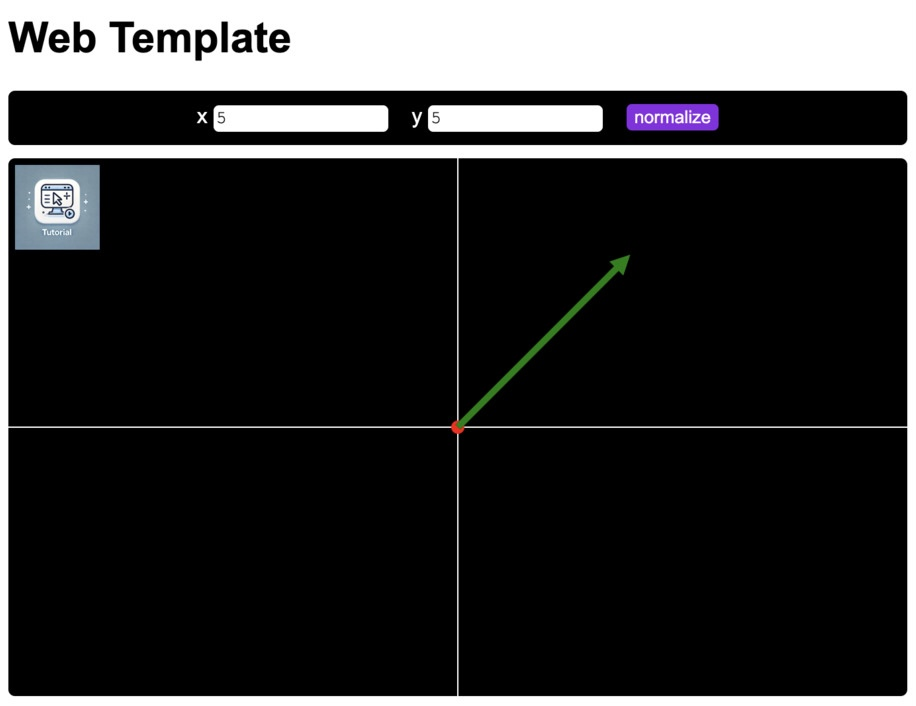

# Web Template

> Template for a Vanilla JavaScript-based Web Application using VSCode: Setup, structuring, debugging, and minification.

There are millions of HTML/JavaScript tutorials available. This one is designed as a starting point for students with little experience in web development, as well as for experienced users who want to switch to _Visual Studio Code_ and utilize its linter and debugger features.

We will not provide a detailed introduction to JavaScript syntax but will demonstrate some object-oriented JavaScript code that is easy to understand. The focus will be on classes, private methods, and a well-structured project setup.

Finally, we will demonstrate how to include external libraries and use a build tool to bundle and minify the code.

_Note: Some of the text in this README was generated by a language model. However, everything has been reviewed and revised by a human (me)._

## Installation

Download and install [Visual Studio Code (VS Code)](https://code.visualstudio.com/download).

Clone this repository via `git clone https://github.com/andreas-schwenk/web-template.git`, or use [GitHub Desktop](https://desktop.github.com), or download and extract the code as `ZIP` file.

Open VS Code and open the example project via `File` &rarr; `Open` from the main menu.

We will need to run a local web server. There are several options for doing this, but the easiest way is to install and use a VS Code extension.

- This repository uses the "Live Server" extension by Ritwick Dey. After opening the repository in VS Code, you will be prompted to install the recommended extensions. If the prompt does not appear, click on "Extensions" in the left panel and install it manually.

- Alternatively, you can run a web server via `python3 -m http.server 5500` (requires Python to be installed).

# Dependencies

`npm` stands for Node Package Manager. It is the default package manager for the JavaScript runtime environment Node.js, allowing developers to share, distribute, and manage dependencies in their projects.

Go to the terminal window (`Terminal` &rarr; `New Terminal` in the main menu) and type `npm i` and press enter, to install all the dependencies listed in file `package.json`.

The only dependency we use here is `esbuild`, an extremely fast JavaScript bundler and minifier. It compiles the source files from the `src/` directory into a single, small JavaScript file in the `dist/` directory. However, since our project is set up as a `module`, a bundler is not strictly necessary. For more details, refer to the "Minification" section below.

# First Run and Debugging

If you open `index.html` in your favorite browser, you will notice that the site does not function correctly: the button does nothing, and the drawing area is black. Open the browser's console to check for any errors. Depending on your browser, you might see messages such as "Failed to load resource: Origin null is not allowed by Access-Control-Allow-Origin." This occurs because the browser does not have permission to access other local files.

Start a local web server on port `5500`. If you prefer to use a different port number, be sure to update it in the `.vscode/launch.json` file.

If you have installed the `Live Server` extension in VS Code, click on `Go Live` in the bottom-right corner of the VS Code window. This will open the `Chrome` browser, and the page should work successfully.

Alternatively, start a web server by running `python3 -m http.server 5500` and then enter `localhost:5500` in your browser's URL bar.



# Files

The following tables show all directories and files from this repository.
You should observe each file to get a deeper understanding.

| path            | description                                 |
| --------------- | ------------------------------------------- |
| `.vscode/`      | Configuration files for the VS Code project |
| `dist/`         | Compiled JavaScript files                   |
| `img/`          | Images                                      |
| `node_modules/` | Dependencies, installed via `npm install`   |
| `src/`          | JavaScript Files = Implementation           |
| `test/`         | Code tests                                  |
| `.gitignore`    | Paths that are ignored by `git`             |
| `build.js`      | Script that outputs files in `dist/`        |
| `index.html`    | HTML file of the web app                    |
| `jsconfig.json` | JavaScript configuration for VS Code        |
| `LICENSE`       | License of this repository                  |
| `package.json`  |                                             |
| `README.md`     | This Readme file                            |

## Details

Directory `.vscode` provides configuration files for this project:

| path                      | description                      |
| ------------------------- | -------------------------------- |
| `.vscode/extensions.json` | Recommended VS Code extensions   |
| `.vscode/launch.json`     | VS Code debugging Configurations |
| `.vscode/settings.json`   | VS Code project settings         |

Directory `src/` contains all JavaScript implementation files:

| path           | description                            |
| -------------- | -------------------------------------- |
| `src/index.js` | Root JavaScript file                   |
| `src/vec.js`   | Implements a class for a 2D-Vector     |
| `src/ctrl.js`  | Implements the behavior of the web app |
| `src/draw.js`  | Implements the drawing of the vector   |

## Classes

The following code demonstrates a class template. Refer to file `src/vec.js` in this repository for a more practical example.

```js
class MyClass {
  static staticAttribute = 3;
  publicAttribute;
  #privateAttribute;

  constructor(...) {...}

  publicMethod(...) {...}
  #privateMethod(...) {...}

  static staticMethod(...) {...}
}
```

Public attributes do not need to be declared outside of the constructor; only private attributes must be declared there. However, it is considered good practice to declare all attributes outside the constructor (TypeScript requires this).

## JSDoc

JavaScript is a dynamically typed language.

A dynamically typed language is one in which variable types are determined at runtime, rather than at compile time, allowing variables to hold values of any type without explicit declarations. This flexibility can lead to simpler code but may introduce runtime type errors.

JSDoc is used in JavaScript to provide inline documentation and type annotations for code, helping developers understand and maintain code by generating documentation and enabling better code editor support, such as autocompletion and type checking.

In VS Code, we use the file `jsconfig.json` to configure the JavaScript language service. For example, it enables features such as IntelliSense, code navigation, and project-wide type checking.

Refer to the file `src/vec.js` and review the JSDoc comments, which begin with `/**`. You should provide JSDoc comments for each class, method, attribute, global variable, method/function parameter, return type, and so on.

## Style of a file

The following template shows the layout of a JavaScript file.

```js
/**
 * Project name
 * Author(s)
 * License.
 */

/*
 * Short summary of the current file.
 */

// <list of imports to external dependencies>

// <list of import to local dependencies, i.e. local JavaScript files>

// <list of global variables>

// <list of classes / functions>
```

Notes:

- Global variables should be used sparingly.
- Only `export` classes and functions when necessary. For example, helper functions should remain visible only within the current file.

## Debugging

## VS Code

## Canvas

requestAnimationFrame

webGL / three.js / ...

## External modules

## Minification

`esbuild` is designed to handle modern JavaScript and TypeScript code efficiently, providing rapid build times and optimized output for web development projects.

babel

`npm run build`

TODO:

- use an external library as how-to
